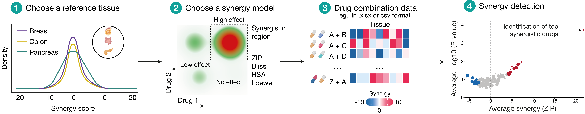
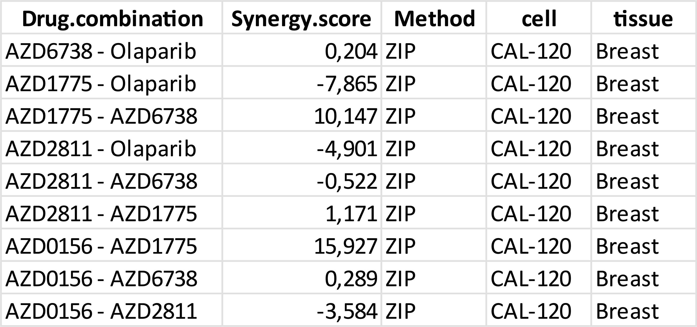

# A statistical framework for defining synergistic anticancer drug interactions



A statistical framework to detect significant drug combination synergies in cancer. Using reference null distributions across various synergy metrics and tissue types, we provide empirical p-values to standardize synergy detection, uncover novel effects, and enable rigorous evaluation of drug combinations.

---

## Quick start: direct application of reference null distributions synergy scores stratified by synergy model and cancer type

```r
# Install/load dependencies
pkgs <- c("dplyr", "readxl", "openxlsx","ggplot2")  
to_install <- setdiff(pkgs, rownames(installed.packages()))
if (length(to_install)) install.packages(to_install)
invisible(lapply(pkgs, library, character.only = TRUE))

# Load reference distributions (example structure: method,tissue,Synergy.score)
zip_results   <- readxl::read_excel("Data/ZIP_results.xlsx")
bliss_results <- readxl::read_excel("Data/Bliss_results.xlsx")
hsa_results   <- readxl::read_excel("Data/HSA_results.xlsx")
loewe_results <- readxl::read_excel("Data/Loewe_results.xlsx")

# Load example dataset 
example_results <- readxl::read_excel("Data/example_results.xlsx")
```

---
## Example dataset input


```r
# Reference datasets in list format to use in the main helper function
refs <- list(ZIP = zip_results, BLISS = bliss_results, HSA = hsa_results, LOEWE = loewe_results)

# Empirical p-value (one-sided)
compute_empirical_p <- function(scores, score) {
  s <- scores[is.finite(scores)]
  N <- length(s)
  if (!is.finite(score) || N == 0L) return(NA_real_)
  if (score >= 0) {
    p.val <- sum(s >= score) / N
  } else {
    p.val <- sum(s <= score) / N
  }
  if (p.val == 0) p.val <- 1 / N
  p.val
}

# Please select a synergy model and tissue for the provided dataset
calculate_pval <- function(refs, method, tissue, scores) {
  ref_df  <- refs[[toupper(method)]]
  ref_vec <- ref_df$Synergy.score[trimws(ref_df$type) == tissue]
  ref_vec <- ref_vec[is.finite(ref_vec)]
  vapply(scores, function(x) compute_empirical_p(ref_vec, x), numeric(1))
}


# Example of usage
# 1) Direct synergy scores in vector format

example_scores <- c(-21.1, -14.9, -9.6, -7, 7, -4.3, -0.6, 0, 0.2, 2.4, 8.9, 10.1, 15.9, 25.3)
pvals <- calculate_pval(refs, method = "ZIP", tissue = "Breast", scores = example_scores)

data.frame( score = example_scores, pval = pvals, log10_pval = -log10(pvals))

# 2) Apply directly with example dataset
example_results$Pval <- calculate_pval(refs, method = "ZIP",tissue = "Breast",scores = example_results$Synergy.score)
head(example_results)
```
---

## Contact information

For any questions please contact:  
- **Diogo Dias** — <ciogo.dias@helsinki.fi>  

---

## Copyright and license

This project is licensed under the **MIT License** — see [LICENSE](LICENSE).  

Repository: <https://github.com/dias-dio/defining-synergy/>

