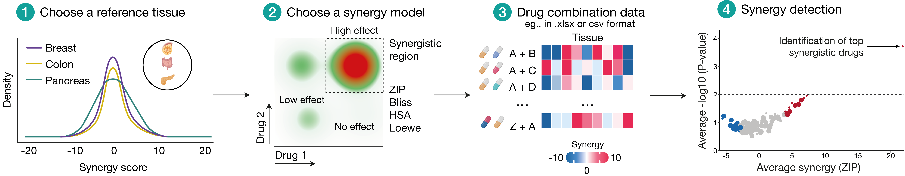
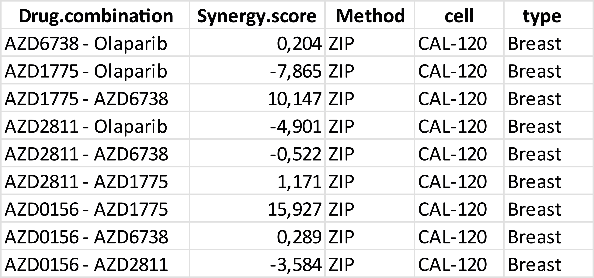
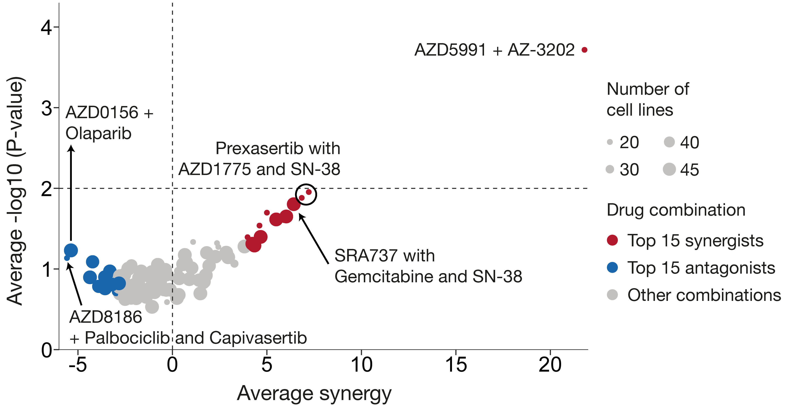

# A statistical framework for defining synergistic anticancer drug interactions



A statistical framework to detect significant drug combination synergies in cancer. Using reference null distributions across various synergy metrics and tissue tissues, we provide empirical p-values to standardize synergy detection, uncover novel effects, and enable rigorous evaluation of drug combinations.

---

## Quick start: direct application of reference null distributions synergy scores stratified by synergy model and cancer tissue

```r
# Install/load dependencies
pkgs <- c("dplyr", "readxl", "openxlsx","ggplot2")  
to_install <- setdiff(pkgs, rownames(installed.packages()))
if (length(to_install)) install.packages(to_install)
invisible(lapply(pkgs, library, character.only = TRUE))

# Load reference distributions (example structure: Drug.combination, Synergy.score, cell, tissue)
zip_results   <- readxl::read_excel("Data/ZIP_results.xlsx")
bliss_results <- readxl::read_excel("Data/Bliss_results.xlsx")
hsa_results   <- readxl::read_excel("Data/HSA_results.xlsx")
loewe_results <- readxl::read_excel("Data/Loewe_results.xlsx")

# Load example dataset (example structure: Drug.combination, Synergy.score, cell, tissue)
example_results <- readxl::read_excel("Data/example_results.xlsx")
```

---
## Example dataset input


```r
# Reference datasets in list format to use in the main helper function
refs <- list(ZIP = zip_results, BLISS = bliss_results, HSA = hsa_results, LOEWE = loewe_results)

# Empirical p-value (one-sided)
compute_empirical_p <- function(scores, score) {
  s <- scores[is.finite(scores)]
  N <- length(s)
  if (!is.finite(score) || N == 0L) return(NA_real_)
  if (score >= 0) {
    p.val <- sum(s >= score) / N
  } else {
    p.val <- sum(s <= score) / N
  }
  if (p.val == 0) p.val <- 1 / N
  p.val
}

# Helper function to directly input synergy model, tissue, and synergy scores
calculate_pval <- function(refs, method, tissue, scores) {
  ref_df  <- refs[[toupper(method)]]
  ref_vec <- ref_df$Synergy.score[trimws(ref_df$tissue) == tissue]
  ref_vec <- ref_vec[is.finite(ref_vec)]
  vapply(scores, function(x) compute_empirical_p(ref_vec, x), numeric(1))
}

# Example of usage
# 1) Direct synergy scores in vector format

example_scores <- c(-21.1, -14.9, -9.6, -7, 7, -4.3, -0.6, 0, 0.2, 2.4, 8.9, 10.1, 15.9, 25.3)
pvals <- calculate_pval(refs, method = "ZIP", tissue = "Breast", scores = example_scores)

results <- data.frame(score = example_scores, pval = pvals, log10_pval = -log10(pvals))
print(results)

# 2) Apply directly with example dataset

example_results$Pval <- calculate_pval(refs, method = "ZIP",tissue = "Breast",scores = example_results$Synergy.score)

example_results$Log10_pval <- -log10(example_results$Pval)

# Volcano plotting: Average within each (Drug.combination, cell)
combo_summary <- example_results %>%
  mutate(Log10_pval = dplyr::coalesce(Log10_pval, -log10(Pval))) %>%
  summarise(
    synergy_cell = mean(Synergy.score, na.rm = TRUE),
    log10_cell   = mean(Log10_pval,   na.rm = TRUE),
    .by = c(Drug.combination, cell)
  ) %>%
  summarise(
    mean_synergy = mean(synergy_cell, na.rm = TRUE),
    mean_log10   = mean(log10_cell,   na.rm = TRUE),
    n_cells      = dplyr::n_distinct(cell),
    .by = Drug.combination
  )

# 2) Tag exact Top 15 synergists / antagonists; everything else "Other"
top15 <- combo_summary %>%
  slice_max(mean_synergy, n = 15, with_ties = FALSE) %>%
  transmute(Drug.combination, cat = "Top 15 synergists")

bot15 <- combo_summary %>%
  slice_min(mean_synergy, n = 15, with_ties = FALSE) %>%
  transmute(Drug.combination, cat = "Top 15 antagonists")

combo_summary <- combo_summary %>%
  left_join(bind_rows(top15, bot15), by = "Drug.combination") %>%
  mutate(cat = tidyr::replace_na(cat, "Other"))

# Plot (one point per Drug.combination; optional size by n_cells)
col_volcano_synergy <- c("Top 15 synergists" = "#B2182B", "Top 15 antagonists" = "#2166AC", "Other" = "#C1C1C1")

volcano_plot <- ggplot(combo_summary, aes(mean_synergy, mean_log10)) +
  geom_point(aes(colour = cat, size = n_cells), shape = 19, alpha = 0.9) +
  geom_hline(yintercept = 2,   linetissue = "dashed", color = "grey20", linewidth = 1) +
  geom_vline(xintercept = -10, linetissue = "dashed", color = "grey20", linewidth = 1) +
  geom_vline(xintercept =  10, linetissue = "dashed", color = "grey20", linewidth = 1) +
  scale_colour_manual(values = col_volcano_synergy, guide = "none") +
  scale_size_continuous(range = c(3, 8)) +
  labs(x = "Average synergy",
       y = "Average -log10 (P-value)",
       size = "n cells") +
  theme_classic(base_family = "Arial") +
  theme(
    axis.title = element_text(size = 24, color = "black"),
    axis.text  = element_text(size = 22, color = "black"),
    axis.ticks = element_line(size = 1.1),
    axis.ticks.length = unit(.40, "cm")
  )

print(volcano_plot)

```
---
## Example output 


---

## Contact information

For any questions please contact:  
- **Diogo Dias** — <diogo.dias@helsinki.fi>  
- **Tero Aittokallio** — <tero.aittokallio@helsinki.fi>

---

## Copyright and license

This project is licensed under the **MIT License** — see [LICENSE](LICENSE).  

Repository: <https://github.com/dias-dio/defining-synergy/>


