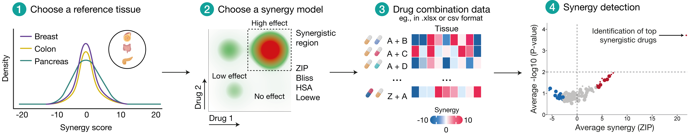
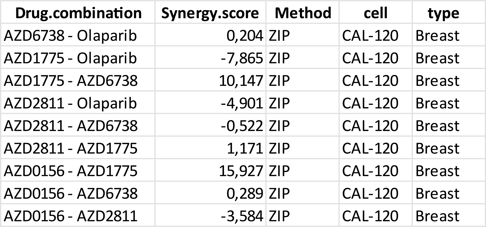
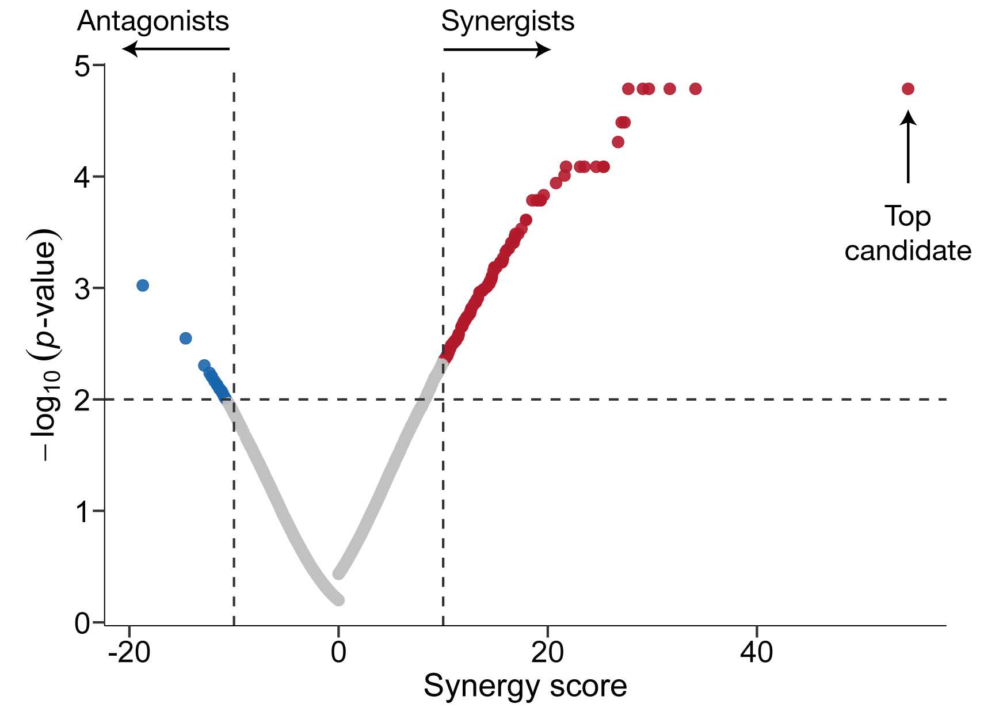

# A statistical framework for defining synergistic anticancer drug interactions



A statistical framework to detect significant drug combination synergies in cancer. Using tissue-specific reference (null) distributions of synergy scores across multiple synergy metrics, we provide empirical p-values to standardize synergy detection, uncover novel interactions and enable rigorous evaluation of drug combinations in new screens, regardless of scale.

---

## Repository structure

| Path | Contents |
| --- | --- |
| `Data/ZIP_results.xlsx` | Tissue-specific reference distributions of ZIP synergy scores (Jaaks et al., self-combinations excluded) with empirical p-values |
| `Data/Bliss_results.xlsx` | Reference distributions, Bliss |
| `Data/HSA_results.xlsx` | Reference distributions, HSA |
| `Data/Loewe_results.xlsx` | Reference distributions, Loewe |
| `Data/ZIP_bh_pval_results.xlsx` | ZIP results with Benjamini–Hochberg adjusted p-values per cell line (one sheet per tissue) |
| `Data/Bashi_results.xlsx` | External validation dataset (Bashi et al., fully measured 7 x 7 matrices), ZIP scores and empirical p-values |
| `Data/example_results.xlsx` | Example input for the tutorial in `R/apply_reference.R` |
| `R/apply_reference.R` | Tutorial: compute empirical p-values for your own synergy scores against the reference distributions |
| `R/figures_main.R` | Code for the main and supplementary figures based on the Jaaks et al. dataset |
| `R/figures_external.R` | Code for the figures based on the Bashi et al. external dataset |

The reference distributions comprise 61,072 (breast), 26,906 (colorectal) and 18,506 (pancreatic) synergy score observations per metric, derived from 1,975 unique drug combinations across 125 cancer cell lines.

---

## Quick start: apply the tissue-specific reference distributions to your own synergy scores

```r
# Load required libraries (installed automatically if missing)
pkgs <- c("dplyr", "readxl", "ggplot2")
to_install <- setdiff(pkgs, rownames(installed.packages()))
if (length(to_install)) install.packages(to_install)
invisible(lapply(pkgs, library, character.only = TRUE))

# Load the reference distributions
# (columns: Drug.combination, Synergy.score, cell, type, ...)
zip_results   <- readxl::read_excel("Data/ZIP_results.xlsx")
bliss_results <- readxl::read_excel("Data/Bliss_results.xlsx")
hsa_results   <- readxl::read_excel("Data/HSA_results.xlsx")
loewe_results <- readxl::read_excel("Data/Loewe_results.xlsx")

references_data <- list(ZIP = zip_results, BLISS = bliss_results,
                        HSA = hsa_results, LOEWE = loewe_results)

# Source the p-value functions
source("R/apply_reference.R")

# Evaluate your synergy scores against a chosen metric and tissue
my_scores <- c(-21.1, -14.9, -9.6, -4.3, -0.6, 0, 0.2, 2.4, 8.9, 10.1, 15.9, 25.3)
results <- calculate_pval(references_data, method = "ZIP", type = "Breast",
                          scores = my_scores)
print(results)
```

For new, independent datasets the empirical p-values use the external formulation p = (b + 1) / (N + 1), where b is the number of reference scores at least as extreme as the observed score and N is the reference size. This guarantees p > 0 and matches the formulation used for external data in the manuscript. A leave-one-out option (`formulation = "loo"`) is available for scores that are themselves part of the reference.

Significant synergistic combinations can then be defined with the dual criterion used throughout the manuscript: synergy score >= 10 and empirical p <= 0.01 (antagonism mirrored at <= -10).

---

## Example input



`Data/example_results.xlsx` contains ZIP synergy scores from the Bashi et al. breast cancer dataset in the expected input format (`Drug.combination`, `Synergy.score`, `Method`, `cell`, `type`). The full worked example, including the volcano plot below, is in `R/apply_reference.R`.

## Example output



---

## Citation

If you use the reference distributions or code, please cite:

Dias D. et al. A statistical framework for defining synergistic anticancer drug interactions (manuscript under review). Details will be updated upon publication.

Underlying screening data: Jaaks et al. Nature 603, 166-173 (2022); Bashi et al. Cancer Discov. 14, 846-865 (2024).

## Contact information

For questions or inquiries, please contact:

- **Diogo Dias** - diogo.dias@helsinki.fi
- **Tero Aittokallio** - tero.aittokallio@helsinki.fi

---

## Copyright and license

This project is licensed under the **MIT License**. See the [LICENSE](LICENSE) file for details.
